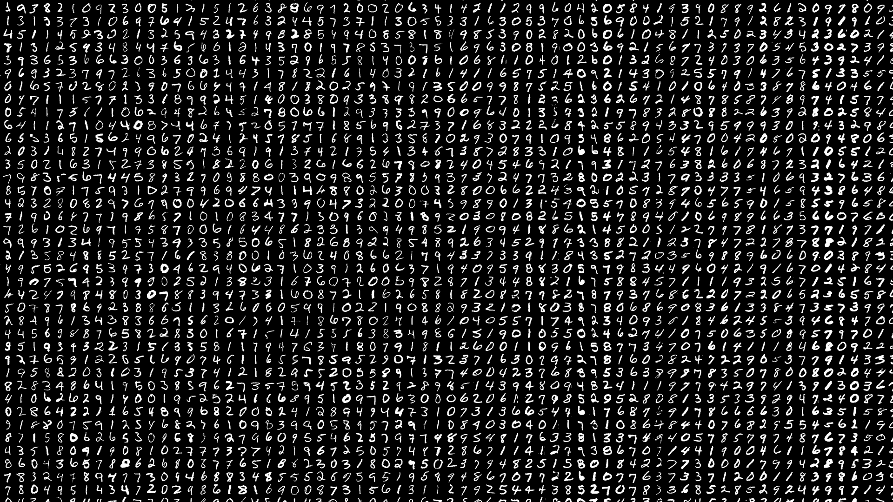

# <u>Hand Written Digits Recognizer</u>

This is a model made out of Neural Network specifically a Convolutional Neural Network model. This was done with a pre-built dataset from the tensorflow and keras packages. There are other alternative libraries that can be used for this purpose, one of which is the PyTorch library.

### Table of contents:

1. Loading the data

2. Loading the data

3. Making the model

4. Compiling and training the model

5. Evaluating the model

6. Testing the model by doing predictions!!

7. How can you try this data on your custom input?

                             

## Libraries Involved

Modules used in creating this model are `numpy` , `os` , `matplotlib` , `tensorflow` , `keras` , `cv2` 

```python
import os
import cv2
import numpy as np
import tensorflow as tf
from tensorflow import keras
import matplotlib.pyplot as plt
from tensorflow.keras.models import Sequential
from keras.layers import Dense,Flatten,Conv2D, MaxPooling2D
```

## Loading the data

Mnist, a built-in dataset from Keras, is used for this model. 

```python
mnist = tf.keras.datasets.mnist
```



                                    (image Source: Kaggle.com)

The data is actually loaded in the form of a numpy array. The entire image is 28x28 pixels in size. When we plot it with matplotlib, we get this image.

The data is being divided into train labels, train images, test labels, and test images.

```python
(train_x,train_y),(test_x,test_y) = mnist.load_data()
```


Now, the colours in this image are divided into three channels, and we don't need to extract their attributes based on colour, from the image. Our model will focus on the archs and lines used in their creation. Furthermore, any image that we consider is presented in the RGB(0-255) by default to our model. To be more specific ,according to the activation of each pixel in the image, the numpy array has values ranging from 0-255. As a result, our model takes a long time to analyse. So to tackel this, we will noramlize the matrix and then extract the featurse to feed our model. which will require less time to master. As a result, once we've normalised our data, our model will see the image as 


Our image is now an array with values ranging from 0 to 1, which is a smart thing to do before feeding it to our model. Now apply the same logic to our entire 60,000-image dataset.

<mark>Before normalization:</mark>


<mark>After normalization:</mark>


Now that we have our data, all we need to do is create a model to feed it. to anticipate our next inputs.

## Making the Model

Now, one of the most important aspects of our model to consider is the layers and how they are organised. So, for my model, I utilised three convolutional layers and a maxpooling layer after each one. After that, I flattened the convolutional model and connected it to the Fully Connected layer.

The below image is the summary of The model .


To comprehend the CNN employed in this model The following photograph, which I obtained after a lot of online surfing, will be useful.!


( Image credits: analyticsindiamag.com )

The image above shows a standard Convolution layer, and the white boxes around the feature map are our image padding, which is usually not required in a model. So that's why I've ruled it out as well.

## Compiling and Training Our Model

Now that we've finished building our model, it's time to teach it the numbers. People in this world are incredibly lethargic when it comes to maintaining a decent handwriting. So that's why ,we need to teach the model the most possible methods to write a digit T T.

This isn't a one-time activity where our model will understand how things operate soon after we show it all the images. Even ,we humans need need some revisions in order to remember things. Similarly, our model must be taught the photos several times, which is referred to as Epochs in deep learning. The greater the number of epochs, the lower the loss while forecasting the image.

Always keep in mind that a NN strives to minimise the loss for each epoch; it does not increase accuracy; rather, it reduces losses, which increases accuracy.

Now , to complie our model we are using adam optimizer 

```python
model.compile(
loss = 'sparse_categorical_crossentropy',
optimizer= 'adam',
metrics = ['accuracy']
)
```

while feeding our model i've used 5 epochs and validated the data with a split of 30% of the training data. we don't want overfitting cases to our data so that's why i choose 5, which is pretty decent regarding my model.

```python
model.fit(
train_x_r,train_y,
epochs = 5,
validation_split = 0.3
)
```

## Evaluating the Model

I obtained 98.12 percent accuracy with a loss of 0.069 while evaluating this model, which is a very good result for a CNN model. but i'll surely be working on 'decreasing the loss' ( you know what i mean!!).


# <u>Predicting the digits using our model</u>

### testing the model with the prbuilt test dataset provied

Lets demonstrate the model,  now lets take a label from our test labels lets say, 63. 


Now lets see the coorresponding image in test_x which contains the image arrays of the hand written numbers.


Now here is the prediction time! let's see what our model predicts


Here, 'p' is the array which contains all the predictions of the test images, and p[63] is the predicted label for test_y[63] image. Hope this completely makes sense.

## Overview of the Model

Finally, it takes the image as input, normalises the image array, predicts all the likelihoods of being each digit using the softmax expression, and finally, this model returns the argumental maximun of that prediction array for that image.

## How can you try this data on your custom input?

Well here comes the exiting part, for this version of model all you need is the path of the image. and just follow these three simple steps.

<mark><u>PS</u></mark>:  clone it, or download the zip, which ever method you find relevant and then strat following the below steps

---

#### *<u>Step-1:-</u>*

draw you digit in you local machine using any simple art tool! how much time its gonna take tho. just make sure you draw the digit with a lighter shade on a darker background to get more accurate result. what i mean is

                          

                        (fig - 1)                                                                       (fig-2)

in the above figures fig-1 will give more accurate results than fig-2. 

#### *<u>Step-2:-</u>*

Copy the path to where you saved the image in any format you want (png, jpg, etc.). It will be easier if you save the image in the same folder as the 'hands-on.py' script.

#### *<u>Step-3:-</u>*

run the hands-on.py script and paste your image-path over there and TADA! you're job is done. all you need to check is the result and praise the model and most importantly star this repo staright after that  🌚! 

---

## Trail

This is the procedure that must be followed. So I used MS Paint to create this digit. and this is how it appears (please don't judge!! :-))


                (eight.png)

and now lets run the program hands-on.py and here's how it works 


And that's how it ends!

If any necessary commits are required to increase the elegance of this model! i'm always open for a PR.

### with this signing off..! lokeshwarlakhi🖖🏾
